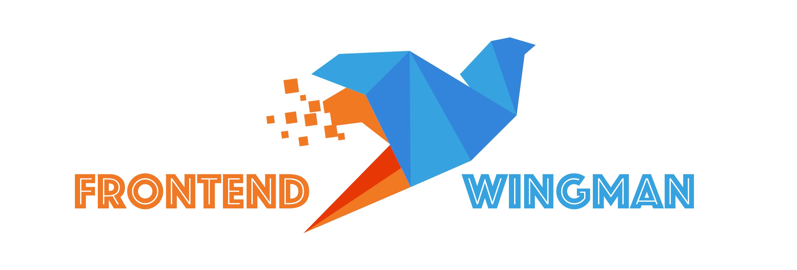

## 什么是  Wingman？

`Wingman` 这一词的含义，根据 U. S. Air Force (美国空军) 的解释是这样的：

*"A wingman (or wingmate) is a pilot who supports another in a potentially dangerous flying environment."*

`Wingman` 是在潜在危险的飞行环境中为另一人提供支持的飞行员。

## 什么是 Frontend Wingman？

这其实是一个我自己造的词，因为前端是一个很杂的技术方向，在学习和提高的过程中，需要去理解和学习的东西太多，太分散了。针对这样的情况， `Frontend Wingman` 能帮你，让你飞得更高，飞得更快。

## 阅读

[线上阅读更清晰](https://dendoink.com/blog/chrome-tricks/00-index) 域名已经更新啦

* 微信扫码关注公众号，订阅更多干货

* 加笔者微信进群与大厂大佬学技(chui)术(niu)

## 内容

* [Chrome 调试技巧](./Chrome.README.md)
* [React 学习指北](./React.README.md)

## 贡献

[参考贡献指南](./Contribution.README.md)

## 协议

[MPL-2.0 License.Copyright (c)](https://github.com/dendoink/FrontendWingman/blob/master/LICENSE)
